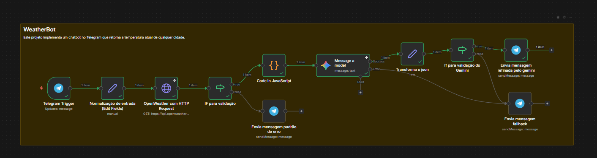

# 🤖 Telegram Clima Bot com N8N

Este projeto implementa um chatbot no Telegram que retorna a temperatura atual de qualquer cidade:

-   **N8N**
-   **Telegram Bot API** para interação com o usuário
-   **OpenWeather API** para consultar o clima
-   **Google Gemini (opcional)** para refinar a mensagem final

------------------------------------------------------------------------

## 📐 Visão geral do fluxo (arquitetura)

O workflow segue o fluxo abaixo:

1.  **Telegram Trigger** -- recebe a mensagem do usuário.
2.  **Normalização de entrada (Edit Fields)** -- limpa texto, remove
    acentos e padroniza a cidade.
3.  **HTTP Request → OpenWeather** -- consulta a API de clima.
4.  **IF (validação 200)** -- separa sucesso de erro.\
5.  **Function (fallback determinístico)** -- monta a mensagem base.
6.  **Google Gemini (opcional)** -- reescreve a mensagem de forma mais
    natural.
7.  **Set (limpeza da saída do Gemini)** -- converte o JSON retornado
    pelo Gemini para objeto utilizável.
8.  **IF (validação do Gemini)** -- decide entre resposta refinada ou
    fallback.
9.  **Telegram Send Message** -- envia a resposta final ao usuário.

### Diagrama do workflow



------------------------------------------------------------------------

## ✅ Funcionalidades

O bot:

-   Recebe uma cidade no formato: `Cidade,UF`
-   Normaliza texto (remove acentos e espaços extras)
-   Consulta a API OpenWeather
-   Retorna a temperatura em °C
-   Trata erros quando a cidade não é encontrada
-   Opcionalmente melhora a resposta com Google Gemini

**Exemplo de uso no Telegram:**

    Salvador,BA

**Resposta esperada (sem Gemini):**

    🌤️ A temperatura em Salvador é de 25°C.

**Resposta esperada (com Gemini):**

    ☀️ Faz 25°C em Salvador — um clima agradável hoje!

------------------------------------------------------------------------

## 🔑 Variáveis de Ambiente (OBRIGATÓRIAS)

Configure no N8N ou no Docker:

### 1) OpenWeather

Crie ou utilize sua chave em: https://home.openweathermap.org/api_keys

No N8N (ou Docker), defina:

    OPENWEATHER_API_KEY= SUA_CHAVE_AQUI

### 2) Telegram

1.  No Telegram, abra **@BotFather** e crie um bot com `/newbot`.
2.  Copie o token gerado.
3.  No N8N, crie uma credencial do tipo **Telegram Bot API** e cole o
    token.

Opcionalmente, se estiver usando Docker, você também pode definir:

    TELEGRAM_BOT_TOKEN= SEU_TOKEN_AQUI

> ⚠️ **Nunca commite tokens reais no repositório.**

------------------------------------------------------------------------

## 🤖 Configuração do Google Gemini (OPCIONAL)

O workflow inclui um nó **Google Gemini** para melhorar a resposta final
ao usuário.
O uso do Gemini **não é obrigatório** --- o bot funciona normalmente sem
ele graças ao fallback em JavaScript.

### Como configurar no N8N

1.  Vá em **Credentials** no N8N.
2.  Clique em **Add Credential** → escolha **Google Gemini**.
3.  Insira sua chave de API do Gemini.
4.  Salve a credencial.

### Como conectar ao workflow

No nó **Google Gemini** do fluxo:

-   Selecione a credencial criada acima.
-   Use um prompt semelhante a:

```{=html}
<!-- -->
```
    Reescreva a mensagem abaixo de forma mais natural em português:
    {{ $json.message }}

    Retorne SOMENTE JSON no formato:
    {"message":"texto final","ok":true}

-   Defina **Temperature/Creativity entre 0 e 0.2** para respostas
    previsíveis.

### Fallback garantido

O fluxo foi construído para que:

-   Se o Gemini **funcionar** → a mensagem refinada é enviada ao
    usuário.
-   Se o Gemini **falhar ou não estiver configurado** → o bot usa
    automaticamente a mensagem gerada no nó **Function (JavaScript)**.

Nenhuma chave do Gemini deve ser incluída no repositório.

------------------------------------------------------------------------

## 📥 Como importar o workflow no N8N

1.  Abra o N8N
2.  Clique em **Import Workflow**
3.  Selecione o arquivo:

```{=html}
<!-- -->
```
    workflow-chatbot-telegram.json

4.  Configure as credenciais:
    -   Telegram Bot API\
    -   Variável `OPENWEATHER_API_KEY`\
    -   (Opcional) Google Gemini
5.  Ative o workflow.

------------------------------------------------------------------------

## 🧪 Testes recomendados

Teste com pelo menos 3 cidades:

-   `São Paulo,SP`
-   `Salvador,BA`
-   `Recife,PE`

Teste erro:

-   `CidadeInventada,XX`

Resposta esperada:

    ❌ Cidade não encontrada. Use o formato Cidade,UF (ex.: São Paulo,SP).

------------------------------------------------------------------------

## 🐳 (Opcional) Docker para rodar N8N localmente

``` yaml
version: "3"

services:
  n8n:
    image: n8nio/n8n
    ports:
      - "5678:5678"
    environment:
      - OPENWEATHER_API_KEY=COLOQUE_SUA_CHAVE_AQUI
      - TELEGRAM_BOT_TOKEN=COLOQUE_SEU_TOKEN_AQUI
```

Rodar com:

    docker-compose up -d

Acesse: http://localhost:5678
